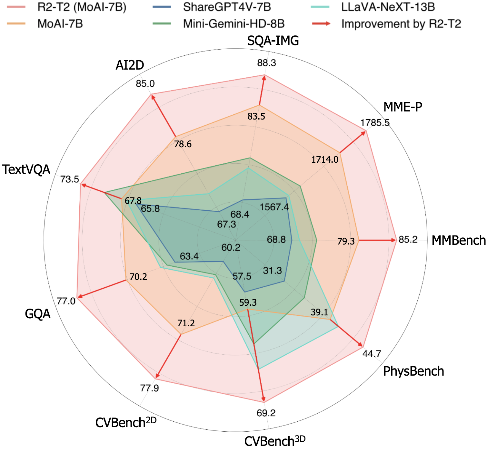

## R2-T2: Re-Routing in Test-Time for Multimodal Mixture-of-Experts 
[Arxiv](https://arxiv.org/abs/2502.20395)

<div align="center">
  
</div>

### Abstract

In large multimodal models (LMMs), the perception of non-language modalities (e.g., visual representations) is usually not on par with the large language models (LLMs)' powerful reasoning capabilities, deterring LMMs' performance on challenging downstream tasks. 
This weakness has been recently mitigated by replacing the vision encoder with a mixture-of-experts (MoE), which provides rich, multi-granularity, and diverse representations required by diverse downstream tasks. 
The performance of multimodal MoE largely depends on its router, which reweights and mixes the representations of different experts for each input. 
However, we find that the end-to-end trained router does not always produce the optimal routing weights for every test sample. To bridge the gap, we propose a novel and efficient method  "**R**e-**R**outing in **T**est-**T**ime(R2-T2)"that locally optimizes the vector of routing weights in test-time by moving it toward those vectors of the correctly predicted samples in a neighborhood of the test sample. We propose three R2-T2 strategies with different optimization objectives and neighbor-search spaces. R2-T2 consistently and significantly improves state-of-the-art LMMs' performance on challenging multimodal benchmarks of diverse tasks, without training any parameters in the base model.

<div align="center">
  
</div>

### Usage

> You should first run the following lines.

```shell script
conda create -n R2T2 python=3.9
conda activate R2T2
conda clean -a && pip cache purge
conda install pytorch==2.0.1 torchvision==0.15.2 torchaudio==2.0.2 pytorch-cuda=11.8 -c pytorch -c nvidia
pip install -r assets/requirements/requirements.txt
pip install -r assets/requirements/requirements_custom.txt
pip install flash-attn --no-build-isolation
```


> You should make directory 'checkpoints' in moai/sgg and upload checkpoint of Scene Graph Generation after downloading it, where its checkpoint filename should be 'psgtr_r50_epoch_60.pth'

Download checkpoints with labeled name 'PSGTR' in [Panoptic SGG](https://github.com/Jingkang50/OpenPSG).


> At init_detector function in mmdet/apis/inference.py, line 95-110 should be commented to get compatibility. 

```python
# if palette != 'none':
#     model.dataset_meta['palette'] = palette
# else:
#     test_dataset_cfg = copy.deepcopy(config.test_dataloader.dataset)
#     # lazy init. We only need the metainfo.
#     test_dataset_cfg['lazy_init'] = True
#     metainfo = DATASETS.build(test_dataset_cfg).metainfo
#     cfg_palette = metainfo.get('palette', None)
#     if cfg_palette is not None:
#         model.dataset_meta['palette'] = cfg_palette
#     else:
#         if 'palette' not in model.dataset_meta:
#             warnings.warn(
#                 'palette does not exist, random is used by default. '
#                 'You can also set the palette to customize.')
#             model.dataset_meta['palette'] = 'random'
```

> At inference_detector function in mmdet/apis/inference.py, line 179- should be changed by the following lines. 

```python
# build the data pipeline
data_ = test_pipeline(data_)

data_['inputs'] = data_['inputs'].unsqueeze(0)
data_['data_samples'] = [data_['data_samples']]

# forward the model
with torch.no_grad():
    results = model.test_step(data_)[0]
```

> In mmcv/transforms/processing.py, line 388 should be commented to get compatibility. 

```python
# results['img_shape'] = padded_img.shape[:2]
```

> Then download the benchmark and reference dataset

```shell script
./download.sh
```

> Run evaluate.py

```shell script
python evaluate.py --reference reference.json --eval CV-Bench --num_neighbors 5 --num_steps 10 --initial_lr 0.01 --final_lr 1e-5
```

### Citation
```
@misc{li2025r2t2reroutingtesttimemultimodal,
      title={R2-T2: Re-Routing in Test-Time for Multimodal Mixture-of-Experts}, 
      author={Zhongyang Li and Ziyue Li and Tianyi Zhou},
      year={2025},
      eprint={2502.20395},
      archivePrefix={arXiv},
      primaryClass={cs.LG},
      url={https://arxiv.org/abs/2502.20395}, 
}
```

### Reference Datasets and Benchmarks

#### Reference Datasets:

[VQA-V2](https://visualqa.org/)

[Visual7W](https://ai.stanford.edu/~yukez/visual7w/)

[COCO-QA](https://www.cs.toronto.edu/~mren/research/imageqa/data/cocoqa/)

[CLEVR](https://cs.stanford.edu/people/jcjohns/clevr/)

[A-OKVQA](https://github.com/allenai/aokvqa)

[TQA](http://textbookqa.org)

[MathVista](https://huggingface.co/datasets/AI4Math/MathVista)

[ST-VQA](https://rrc.cvc.uab.es/?ch=11)

[DocVQA](https://www.docvqa.org/datasets)

#### Benchmarks:

[MMBench](https://github.com/open-compass/MMBench)

[MME-P](https://github.com/bradyfu/awesome-multimodal-large-language-models)

[CVBench](https://huggingface.co/datasets/nyu-visionx/CV-Bench)

[GQA](https://cs.stanford.edu/people/dorarad/gqa/about.html)

[SQA-IMG](https://scienceqa.github.io/)

[AI2D](https://paperswithcode.com/dataset/ai2d)

[TextVQA](https://textvqa.org/)

[PhysBench](https://huggingface.co/datasets/USC-GVL/PhysBench)

---

**Acknowledgement: This code is based and developed on [MoAI](https://github.com/ByungKwanLee/MoAI.git).**

